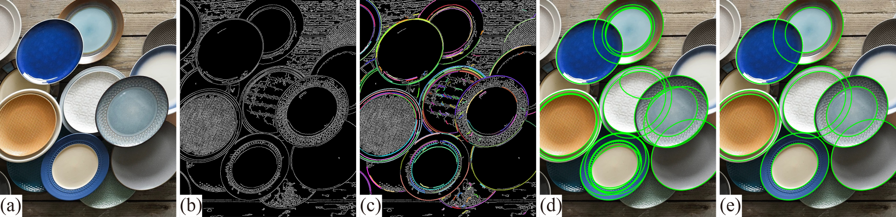

# EllDet
An ellipse detector for RGB images implemented in C++. 

This is the code for paper ["Combining Convex Hull and Directed Graph for Fast and Accurate Ellipse Detection"](https://doi.org/10.1016/j.gmod.2021.101110).

(The source code is currently under cleaning and checking, and the final version will be released as soon as possible.)



## Requirements
* CMake 3.18
* C++ compiler with C++17 support.
* OpenCV 4.3.0
* Vcpkg is recommonded to simplify the building proceedure.

## Usage
### Setup
* Clone this repo:

```cmd
git clone https://github.com/meiyy/EllDet.git
cd EllDet
```
* Usage CMake to generate the project:

```cmd
mkdir build
cd build
cmake ..
```

* Build the project by `make` (Linux) or `Visual Studio` (Windows).

### Test

Run the following command to detect the ellipses in an given image file:

```cmd
elldet demo.bmp
```
## Dataset

See folder "datasets".

Groundtruth for ellipse detection are stored in IMAGE_NAME.gt.txt (for example: a.jpg.gt.txt for image a.jpg).
The first line of the gt file is the number of ellipses. 
Each of the rest lines represents an ellipse in the format: (center.x, center.y, a, b, rotation_angle).

## Contact

If you have any question about the code, please feel free to contact me.
Email: shenzeyu2018@ia.ac.cn